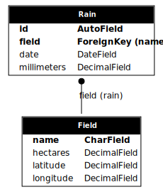

# Prueba técnica de Python

## Configuracón de entorno
```
git clone https://github.com/emanuelcima/python_test.git

python3 -m venv env
source env/bin/activate
pip install -r ./python_test/requirements.txt

cd python_test
python manage.py runserver
```

## Modelo
<p align="center">
  
</p>

## Api
| URL                             | Método HTTP | Acción | Descripción
| ------------------------------- | ----------- | ------ | ------------
| rains/{field}/                  | POST        | create | Crea una lluvia para el campo dado
| rains/?field={campo}            | GET         | list   | Lista todas las lluvias del campo {campo}
| fields/?average_rain={dias}     | GET         | list   | Listado de campos con su promedio de lluvia en los últimos {días}
| fields/?accumulated_rain={mm}   | GET         | list   | Listado de campos donde la lluvia acumulada es mayor a {mm}
